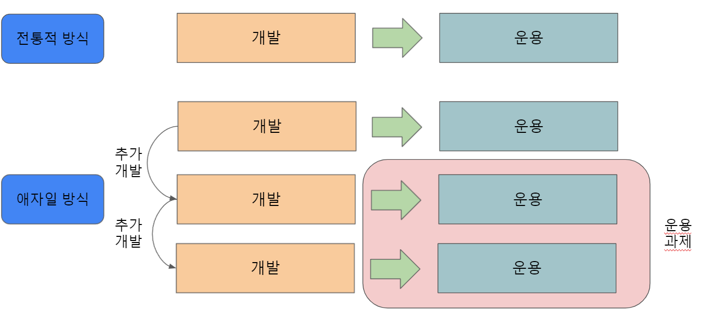

### [이전 섹션으로 돌아가기](../)
# DevOps의 탄생 배경

DevOps는 어느날 갑자기 생겨난 게 아닙니다.

오랜 시간 동안 사용되며 계속 발전해온 개발 방법을 토대로 어떻게 하면 `어떻게 지금보다 더 효율적으로 개발할 수 있을까?` `지금보다 더 좋은 방안으로 개선하려면 어떻게 하면 좋을까?` 같은 질문의 해결 방법으로 오늘의 DevOps가 탄생하게 되었습니다.

DevOps가 탄생하기까지 배경으로는 크게 2가지를 들 수 있습니다.

- 애자일 방법론 의한 계속적인 개발로의 변화

- 계속적인 개발로 인해 나타나는 운용 과제

애자일 방법론의 다양한 도구와 방법, 거기서 생겨난 운용 과제가 DevOps라는 것을 탄생시켰습니다.

# [애자일 개발에의한 계속적 개발로의 변화](../sub2)