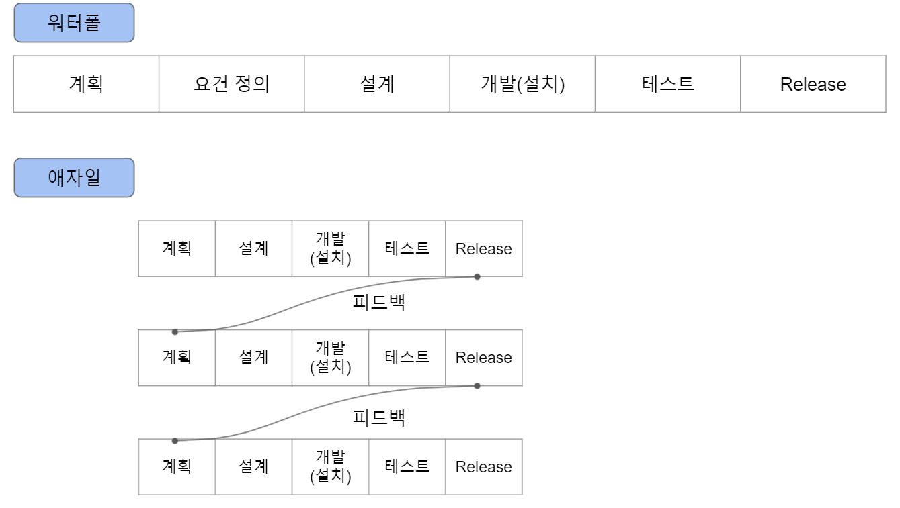

### [이전 섹션으로 돌아가기](../sub1)

# 애자일 개발에 의한 계속적 개발로 변화

1980년 때 부터 서비스 개발에 워터폴(Waterfall)이라는 개발 방법이 오랜 기간 이용되어 왔습니다.

워터폴 형태의 개발에서는 개발 공정을 분할하고 이전 공정이 끝나지 않으면 다음 공정이 진행될 수 없는 개발 형태를 가지고 있습니다.

공정을 분리하는 방법은 여러가지가 있지만 계획 - 요건 정의 - 설계 - 개발(설치) - 테스트 - Release - 운용과 같이 나누어진 공정을 상류에서 하류로 한 단계 한 단계 폭포가 흘러 내려가듯이 진행시킵니다.

각 공정마다 확실하게 완료된 상태로 진행해감으로써 시스템 전체의 품질을 향상시키는 방식이므로 매우 많은 시간이 필요합니다.

이전 공정이 완성되어 있는 것을 전제로 하기 때문에 한 번 설계하여 개발한 것에 변경 사항을 반영하는 일은 거의 없습니다.

만약 변경이 있다고 하더라도 시험 단계까지는 대부분의 요건에 대한 조정이 완료되며 프로젝트를 진행하는 도중에 새로운 요구조건으로 대응하는 것은 규모적인 측면에서도 대부분 불가능하다는 문제점이 있습니다.

하지만 현대의 Web 서비스에서는 상당히 짧은 기간에 기능 추가, 개선의 요구가 발생하고 있습니다.

워터폴 형태의 개발은 이와 같이 짧은 기간에 점차적으로 요구 사항이 적용되고 상세한 변경이 반복되는 상황 즉, 유연성이 필요한 개발에는 대응하기 매우 어렵습니다.

그래서 서비스를 정책적으로 실시하면서 피드백을 받아 개발을 여러 번 반복하는 프로토타입 모델과 소규모 개발을 전제로 필요한 최소한의 요건을 적용한 성과물을 만들어 Release 하고, 고객의 피드백을 받아서 계속적인 개선을 반복하는 "애자일 개발" 방법론 등이 탄생하면서 짧은 기간에 개발 사이클을 진행할 수 있는 기반이 만들어 졌습니다.

애자일에서는 워터폴 방식과 다르게 기능의 추가가 빈번하게 이루어집니다. 워터폴 같은 방법에서는 생각할 수도 없는 업데이트 횟수에 대응하고 계속적으로 개선을 반복하기 때문에 계속성 및 효율을 추구하는 개발 방법이나 도구가 생겨나고, 지속적 통합(Continuous Integration)이라는 개념이 생겨났습니다.

개발자는 개발 범위 효율화 및 자동화를 추진하는 지속적 통합이라는 성과물 생성과 관련된 효율화를 진행했지만, 어떻게 하여도 운영 측면 과제가 존재한다는 것을 알게 되었습니다.

# [계속적 개발로 인해 나타나기 시작한 운용 과제](../sub3)
