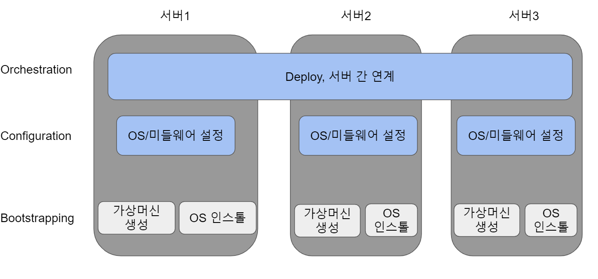
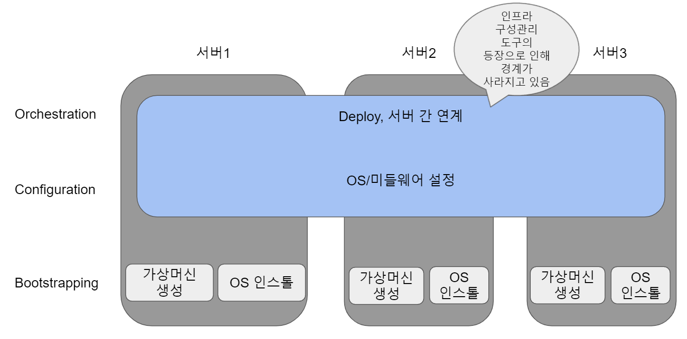

### [이전 섹션으로 돌아가기](../sub2)

# 계속적 개발로 인해 나타나기 시작한 운용 과제

개발자는 운용 측면에 과제를 해소하고 싶어했으며 특히, 본인이 대응할 수 없엇던 인프라 관련 설정, 구축을 보다 효율적으로 어떻게 해야 좋을지에 대한 방법을 생각하게 되었습니다.

인프라 구축, 설정 변경을 자동화하는 도구는 오래 전부터 존재하고 있었고, 애자일 개발의 등장과 함께 이러한 자동화 도구들이 계속성이나 효율화를 실천하기 위한 도구로써 점점 받아들어지게 됐습니다.

> Agile 2008 conference

Agile 2008 conference에서 패트릭 드부와가 Agile Infra-structure & Operations라는 자료를 발표했습니다.

이 자료에서 개발과 운영, 특히 개발과 인프라는 서로 분리되어 있는 현상에 대해서 언급합니다.

- 운용 측면의 문제점

	- 얼마나 영향을 주는지 몰라서 업데이트 용 패치를 적용하지 않음

	- 하드웨어 기술 지원 기간이 종료됨

	- 신속한 보안을 위해 스크립트를 재시작함

	- 마이그레이션이 불완전하게 끝남

	과 같은 `기술적 부담`을 떠안게 됩니다.

- 개발 측면의 문제점

	- 스페셜리스트만 존재함

	- 누구도 다른일을 하고 있지않음

	- 추가 기능 및 개선 사항을 관리하는 리스트에는 TO DO만 존재함

	- 애플리케이션 내부에 대한 지식이 없음

	과 같은 문제점이 있습니다.

운용 문제에 대해서는 `데일리 스크럼`으로 불리는 일일 회의를 통해 진행 방향에 대한 해결책을 도출하고 팀 멤버의 관심 여부에 따라 우선 순위를 매기거나 태스크에 페어로 대응하고 `information rediation`(정보 공유)라는 이른바 정보가 자연스럽게 전해지는 상태를 형성할 필요성을 언급하고 있습니다.

개발 문제에 대한 해결책은 `CFT`로 인프라팀을 포함시킨 애자일 개발이 하나의 해결방법으로 얘기되고 있습니다. 인프라의 요구사항을 기존보다 더욱 이른 단계에서 가시화하고 발생할 수 있는 문제를 더 명확히 하는 것을 추천하고 있습니다.

> Agile Conferece 2009

위의 발표이후 2009년에 Agile 2009 Conference(애자일 회의 2009)에서 앤드류 세이퍼는 애자일 인프라라는 발표를 했습니다.

Web 개발에서 발생하는 개발과 운용사이의 혼란을 Wall of Confustion(혼란의 벽)이라고 명명하고 있습니다.

이에대한 해결 방안으로 우리는 이 벽을 넘어서 개발과 운용이 서로 간의 영역으로 들어가 애자일 개발처럼 인프라가 운용되는, 애자일 인프라를 실현하는 수단으로써 Infrastructure as Code라는 주제로 방법을 설명하고 있습니다.

모든 버전을 관리 하는 것에 대한 예시로써 소프트웨어 뿐만 아니라 configuration 관리를 도입해서 인프라를 관리하는 것, 원스텝 디플로이(one-step deploy), 모니터링, 인프라의 지속적 통합 등이 언급되어 있습니다.

특히 정보 공유의 기본 개념으로써, 개발과 운용은 같은 장소에서 동일한 것을 본다는 것을 실현하기 위한 수단으로, 코드화된 구성 정보를 동일한 소프트웨어 관리 시스템의 Repository에 적재하여 가시화하는 것을 언급하고 있습니다.

또한 전체 인원이 어떤 버전이 사용되는지 파악하기 위한 branch 운용에서는 항상 메인 branch에서 release 하는 방법 등에 대해서 언급하고 있습니다.

위와 같이, "계속적인 개발로 인해 나타난 운용 과제"로 부터 DevOps 라는 사고방식이 형성되고, 운용 과제에 대한 해결책으로써 개발과 운용이 정보를 공유하는 가시화 과정을 통해 인프라의 코드화가 가속화되어 IaC(Infrastructure as Code)가 형성되어 갔습니다.

## 운용과제 해결책으로써 인프라 구성 관리 도구

운용과제 해결을 위한 수단인 DevOps의 인프라 코드화는 서버와 스토리지, 네트워크 등 인프라에 대한 설정을 수행하는 인프라 구성 관리(Provisioning) 도구에 의해서 발전했습니다.

프로비저닝이라고 한마디로 정의하고 있지만, 도구로 인프라 설정이 가능한 범위는 다양합니다.

Velocity2010에서 리톰슨은 Provision Toolchain 프레젠테이션에서 서버의 프로비저닝을 3개 영역을 분류했습니다.

| 프로비저닝 영역| 설명 | 해당하는 도구 예시|
|----------------|--------------|----------------|
|오케스트레이션(Orchestration)| Deploy나 노드간 연계 등 복수의 서버에 대한 설정이나 관리를 담당 | Capistrano, Func|
|컨피규레이션(Configuration)| OS, 미들웨어의 설정을 담당 | SmartFrog, CFEngine|
|부트스트래핑(BootStrapping)| 가상 서버 생성이나 OS설치를 담당 | Kickstart, Cobbler|

> 부트스트래핑

최초의 부트스트래핑 영역은 가상 머신이나 OS의 설치, Setup을 말합니다.

쉽게 설명하면, 인프라 운용 담당자가 기본이 되는 OS를 설치하는 경우에 이용되는 도구가 됩니다.

가상 머신이나 Docker 같은 컨테이너가 당연한 것이 된 현재는 가상 머신의 템플릿이나 서버 이미지를 만들고, 한 번 만들어 놓은 이미지를 바탕으로 설정에 대한 변경 작업을 실시하는 경우가 많아졌습니다.

따라서 인프라 담당자의 담당 영역도 하드웨어 보다는 소프트웨어에 보다 가까워지고 있는 등 부트 스트래핑을 이용한 작업의 수행은 많이 없어졌습니다.

가상머신의 생성으로부터 킥스타트와 연동한 게스트 OS 설치, 그리고 템플릿화까지를 일괄적으로 실행하는 도구도 등장하고 있습니다.

대표적으로 하시코프의 Packer가 존재합니다.

> 컨피규레이션

컨피규레이션 영역은 부트스트래핑이 끝난 서버에 대한 OS 설정 변경이나 미들웨어의 설정 적용 등을 지칭합니다.

> 오케스트레이션

개발 결과물을 복수의 서버로 일괄 Deploy(배포) 하듯이 여러 대에 동일한 설정을 하는 작업을 말합니다.

> 최근의 프로비저닝 구성 이미지

최근에는 Puppet이나 Chef, Ansible 등의 구성 관리 도구로 인해 컨피규레이션과 오케스트레이션의 경계선이 사라지고 있습니다.

구성관리 도구는 여러 서버를 Web 서버 그룹, DB 서버 그룹처럼 분류하고 각각의 그룹에 대하여 설정을 배포하거나 명령을 실행할 수 있습니다.

## IaC와 DevOps

IaC(Infrastructure as Code)는 "인프라의 코드화"라는 뜻으로, 인프라 구성관리 도구에 의한 설정의 코드화, 구성 정보화 전체를 의미합니다.

중요한 것은 모든 인프라는 이 설정, 구성 정보에 의해서만 구축, 설정이 변경된다는 것입니다.

인프라 구성 관리 도구 중에서도 특히, 컨피규레이션 도구는 직접 실제 기기에 설정을 하는 대신, 서버나 미들웨어의 구성 정보와 설정 정보를 파일에 기재하고 도구를 이용하여 정의 파일대로 설정을 수행하여 "계속적인 개발로 인해 나타난 운용 과제"의 해결 방법이 되는 도구 그룹입니다.

파일에 작성한대로 구성과 설정이 실행되기 때문에 인프라 플랫폼의 차이로 인해 생기는 문제가 발생하지 않게됩니다.

이처럼 IaC는 인프라 구성과 설정의 구성 정보화에 의해서 소프트 웨어 영역으로 전환되고, 인프라의 구성과 설정에 있어서도 소프트웨어 개발 방법을 적용하는 것이 가능해집니다.

설정을 변경하기 위해서는 코드와 같은 구성 정보를 기술하고 구성은 일반적인 애플리케이션 개발과 같은 방법으로 테스트 가능한 도구를 사용하여 테스트합니다.

완성된 구성정보는 코드와 마찬가지로 버전을 관리합니다.

애자일 개발 방식을 IaC를 통해서 인프라 구축 운용에도 적용하는 것이 가능하게 되었습니다.

또한 IaC라는 단어에서도 알 수 있듯이, 인프라를 코드로 표현한다고 해도 코드화를 위한 고도의 프로그래밍 지식은 필요 없습니다.

대부분의 설정도구에서는 프로그래밍 언어보다 쉬운 DSL(Domain Specific Language)로 인프라 구성과 설정을 기술할 수 있게 되었습니다.

그 덕분에 프로그래밍과 무관한 인프라 엔지니어도 일반적인 미들웨어의 설정을 습득하는 정도의 난이도로 IaC를 할 수 있게 되었습니다.

따라서, 인프라 엔지니어와 애플리케이션 엔지니어도 인프라 설정, 운용에 대해서 이전보다 소통하기가 쉬워졌습니다.

개발과 운용이 긴밀하게 연계되어 비즈니스 가치를 높이려는 DevOps에 있어서, 애플리케이션 개발 담당자가 인프라 운용에 대해서 소프트웨어 지식을 이용하여 이해하고, 혹은 직접 설정을 변경할 수 있게 되는 IaC는 매우 중요합니다.

## 인프라 설정도구의 역사와 특징

> CFEngine
현재 인프라 설정도구의 원형이 된 CFEngine은 1993년 마크 버지스에 의해서 오픈 소스 설정도구로 등장했습니다.

인프라 설정도구의 조상이라고 불리기도 합니다.

C언어로 기술되어있어 매우 가볍게 동작하는 것이 특징이고 또한 시스템 간의 차이를 C언어 등으로 확장하지 않고 DSL을 이용하여 구성을 기술할 수 있는 점에서 매우 주목받았습니다.

> Puppet

퍼펫은 2005년 루크 캐니스가 Ruby로 개발한 인프라 설정 도구입니다.

퍼펫은 매니페스트로 불리는 구성 정보 파일에 독자적인 DSL로 구성을 선언하는 것이 가능합니다.

퍼펫은 C언어로 쓰여진 CFEngine과 비교해서, Ruby로 되어있기 때문에 휴대성이 뛰어납니다.

> Chef

Chef는 2009년에 아담 제이콥이 ruby와 Erlang으로 작성된 인프라 설정 도구입니다.

레시피로 불리는 구성 정보 파일에 Ruby 기반의 DSL로 구성을 기술하고 Ruby의 문법을 그대로 사용할 수 있는 것이 특징입니다.

> Ansible

Ansible은 2012년에 미첼 드한이 Python으로 작성한 인프라 설정 도구입니다.

설정, 구성 정보는 YAML 형식으로 표현되지만 실제 기계에 대한 설정을 수행하는 실행 모듈을 다양한 언어로 기술할 수 있는 것이 특징입니다.

> 인프라 설정도구로 얻을 수 있는 장점

- 자동화 : 자동화에 의한 빠른 설정이 가능합니다.

- 선언적 : 구성 정보에 의해 현재 설정 대상의 설정 상태를 명확하게 기재할 수 있고 이를 보고 어떤 설정이 이루어졌는지 파악할 수 있습니다.

- 추상화 : 구성 정보를 설정 대상의 세부적인 환경 차이에 따라서 나누어 기술할 필요가 없습니다. 이로 인해 가능한 한도에서 코드 실행의 전문성 배제가 가능해집니다.

- 수렴화 : 설정 대상이 어떠한 상태이더라도 기대한 상태로 변경될 수 있습니다.

- 멱등성 : 몇 번을 실행해도 같은 결과를 얻을 수 있습니다.

# [DevOps 탄생과 역사](../sub4)